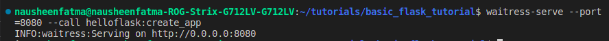
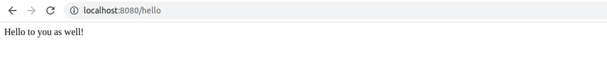

# Basic Flask Tutorial
This is a project to learn and implement basic web development in python using flask and run on localhost.
This page was followed to build this tutorial: https://www.tutorialspoint.com/flask/

## 1. Install flask

```
pip3 install flask
```

## 2. Clone this repo

```
git clone https://github.com/nausheenfatma/basic_flask_tutorial.git
```

## 3. Run the following commands:

Goto root directory:

```
$ cd basic_flask_tutorial
$ python3 helloflask.py
```

If the command runs successfully, it should look like this:


## 4. Try the following URL options on the localhost on a web browser:

1. http://127.0.0.1:5000 prints welcome message


2. http://127.0.0.1:5000/hello prints hello message 


3. http://127.0.0.1:5000/hello/nausheen prints hello message with URL variable. 


4. Till now the messages were rendering from python return statements 
http://127.0.0.1:5000/hellopage renders an html pagefound in templates/hellopage.html instead of strings returned from python


5. http://127.0.0.1:5000/userinfo is a form to take user input and display after submit to next page


6. File uploads example: http://127.0.0.1:5000/upload page to upload a file. 


Voila! Congratulations on learning how to run flask locally!

## 5. Running flask for production

Wait, we are not done yet! If you notice that running the flask app gives a warning:
WARNING: This is a development server. Do not use it in a production deployment. Use a production WSGI server instead.


Check this reference docs : https://flask.palletsprojects.com/en/2.2.x/deploying/

The docs clearly mentions:
After developing your application, you’ll want to make it available publicly to other users. When you’re developing locally, you’re probably using the built-in development server, debugger, and reloader. These should not be used in production. Instead, you should use a dedicated WSGI server or hosting platform.

Now there two ways:
1. Self hosting options
2. Using Hosting platforms

I chose Waitress which is a pure Python WSGI server. You may try others.

Steps : 

## Install waitress

```
pip3 install waitress
```

## add a function create app in the python file

```   
def create_app():
   return app
```

## use waitress in command line to run

```
waitress-serve --port=8080 --call helloflask:create_app
```


Now check URL http://localhost:8080/hello on localhost

