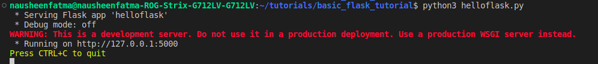
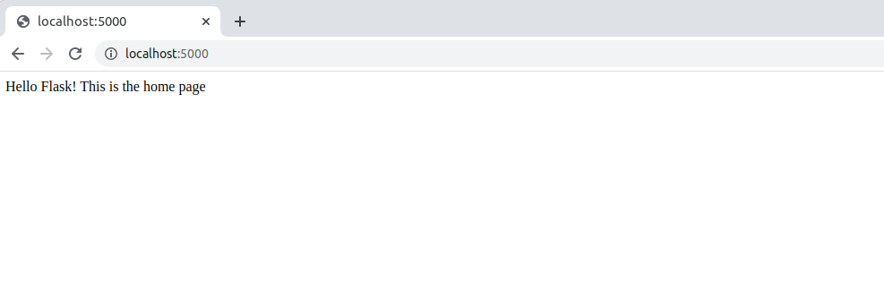
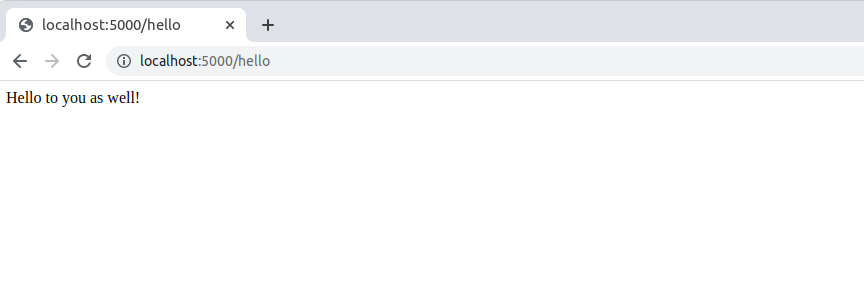
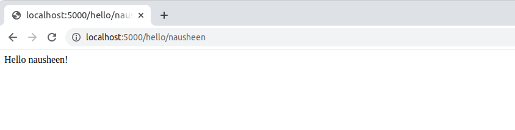
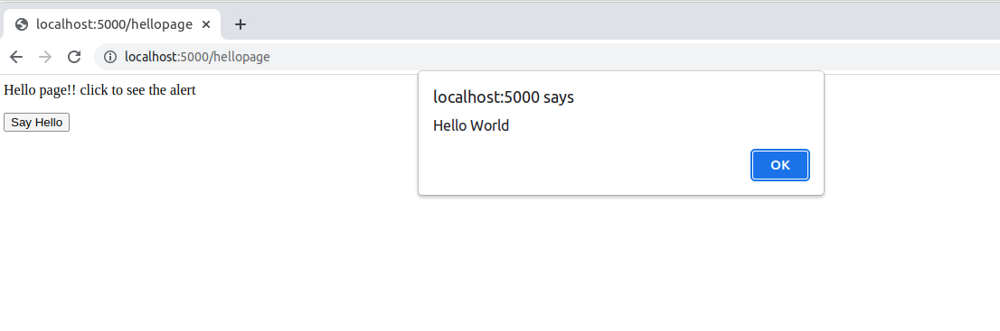
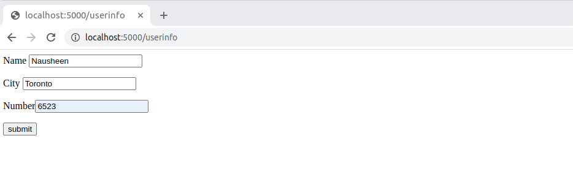
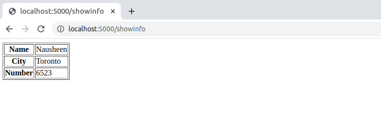
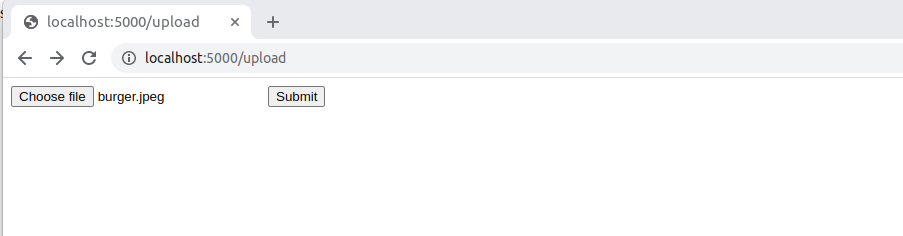
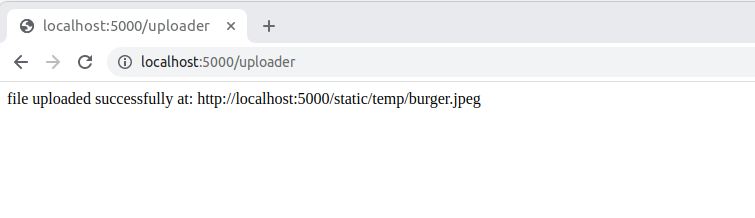

# basic_flask_tutorial
This is a project to learn and implement basic web development in python using flask and run on localhost.
This tutorial was followed to build this project: https://www.tutorialspoint.com/flask/

## Run the following commands:

Goto root directory:

```
$ cd basic_flask_tutorial
$ python3 helloflask.py
```




## Try the following URL options on the web browser:

1. http://127.0.0.1:5000 prints welcome message


2. http://127.0.0.1:5000/hello prints hello message 


3. http://127.0.0.1:5000/hello/nausheen prints hello message with URL variable. 


4. Till now the messages were rendering from python return statements 
http://127.0.0.1:5000/hellopage renders an html pagefound in templates/hellopage.html instead of strings returned from python


5. http://127.0.0.1:5000/userinfo is a form to take user input and display after submit to next page



6. File uploads example: http://127.0.0.1:5000/upload page to upload a file. 


